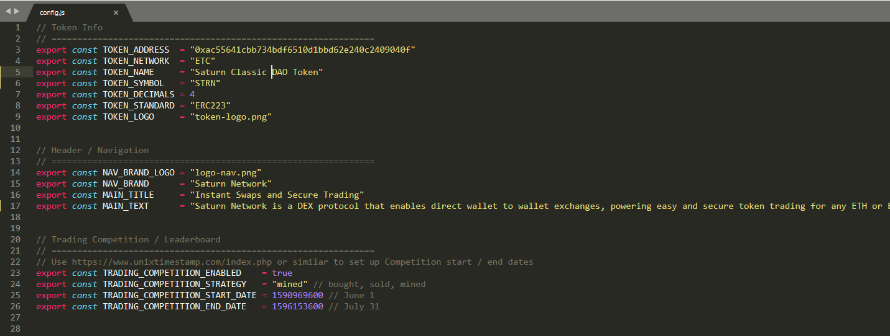
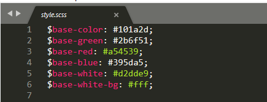

[](https://gitpod.io/#https://github.com/saturn-network/ring-simple)

# BlackDiamond SC Widget
Easily deploy an alternative mirror for any token market listed on Saturn Protocol, an exchange protocol for peer to peer trading on Ethereum and Ethereum Classic featuring automated and free token listings.

* Website: [blackdiamondsc.tec](http://blackdiamondsc.tech/)
* Learn: [what is blackdiamond sc?](http://blackdiamondsc.tech/)
* Twitter: [@ScBlackDiamond](https://twitter.com/scblackdiamond/status/1371030613029961728?s=21)
* Reddit: [u/BlackDiamondSC](https://www.reddit.com/u/BlackDiamondSC/?utm_source=share&utm_medium=ios_app&utm_name=iossmf)
* Discord: [BlackDiamondSCToken](https://discord.gg/nkbF9Hr6)
* Email: [support@blackdiamondsc.tech](mailto:support@blackdiamondsc.tech)

## Key features?

✅ Open source.

✅ Lightweight, can be deployed anywhere.

✅ Highly customizable.

✅ Supports Ethereum and Ethereum Classic.

✅ ERC20 and ERC223 tokens.

## Development

Download this repository, open the folder in terminal and run the following:

```
yarn
yarn install
yarn start
```

It will open up the default Saturn Widget configuration in your web browser `http://localhost:3000/`.

### Configure Mirror Token

To configure your mirror open up `/src/config.js` with your favourite text editor. It will look as follows:



You should amend it to reflect the details of the token you wish to be tradable on your mirror. Take care to set `TRADING_COMPETITION_ENABLED` to `true` or `false` depending on if you would like to generate a leaderboard or not. You will need to place the graphic and logo assets you wish to use in the `/public/` folder. Everytime you update and save the `/src/config.js` file, you will notice that your web browser will refresh `http://localhost:3000/`. This way you can easily see how your changes will look.

### Style Configuration
Your mirror's frontend general theme (such as the default background color) is all configured in the following `/src/style.scss` file. You will probably want to change the top lines:



To create a theme that reflects your community. Again simply save any edits to watch them updated in realtime on your web browser. That's all you need to know to make basic changes! If you know react and javascript, you can fully customize the UI located in the `src` folder. You may also be interested in making changes to the .js files found in `/shared/` which control how users connect to their wallet and what messages are displayed when they are not logged in.

### Ready to deploy your mirror?
Make sure you compile your frontend changes with the following command: `yarn frontend:build`.

### Deploy to website and make it public


We recommend using your own server or one of the free providers of hosting open source websites.
Typically, this would mean

1. Clone this repository
2. Make edits to it, edit your custom theme + select your token
3. Deploy to [github pages](https://pages.github.com/), [vercel](https://vercel.com/) or [netlify](https://www.netlify.com/)

### Short guide to deploy to Github Pages

Github pages is a free hosting solution for open source repositories. Dapps like [Saturn Rings](https://www.saturn.network/blog/saturn-rings-incentivized-mirrors-for-saturn-protocol/) and Saturn Widgets can take advantage of this fantastic opportunity.

First, create the production frontend build. Then,

Just [follow this incredible guide](https://dev.to/yuribenjamin/how-to-deploy-react-app-in-github-pages-2a1f) and you'll have the widget published in no time!

The package.json file in this repository already contains all the necessary dependencies and scripts. Simply modify the name, author, homepage, configure your github remote and run `yarn deploy`.
